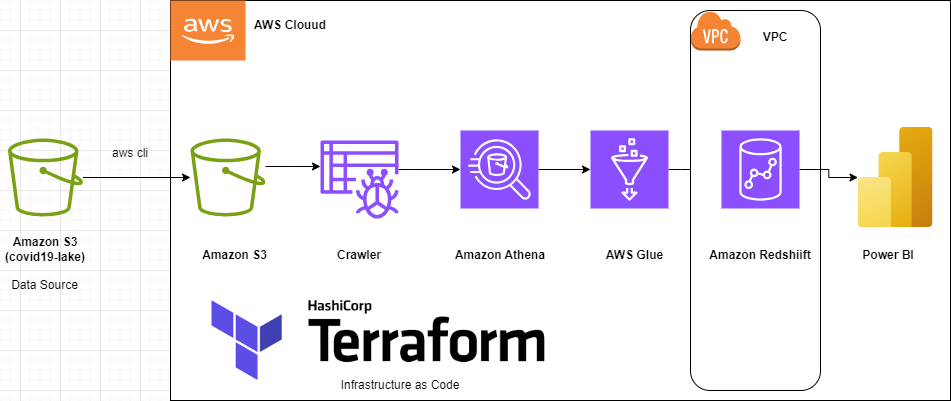

# Covid-19 Redshift Warehouse Project


> Architecture Diagram

## Project Overview

As a prospective Data Engineer, I wish to use this project to exhibit the
knowledge I have acquired over the past few months of studying. 

The main goal of the project is to build infrastructure on AWS with the use of code. Also, I will show how to seemlessly move data from one to another within this infrastructure, query and also do some transformations.

## Setup Instructions

### Prerequisities

+ Python 3.10 (any version of python >= 3.6)
+ AWS account **(Iam account preferrable)** and you have to install [aws cli v2](https://docs.aws.amazon.com/cli/latest/userguide/getting-started-install.html)
+ You also have to install [terraform](https://developer.hashicorp.com/terraform/tutorials/aws-get-started/install-cli#install-cli)

### Steps to follow

1. Clone the Repo:
```bash
git clone https://github.com/fafugah1/Covid19-Redshift-Warehouse.git
cd Covid19-Redshift-Warehouse
```

2. Make the necessary renaming changes required in the *main.tf* and *variable.tf* files.

For example, my main project bucket name is **frank-covid-19-bucket**, provide a universally unique name of your choice to avoid conflict.

3. Run the **main.tf** file to create your infrastructure:
```bash
cd terraform
terraform init
terraform plan 
terraform apply --auto-approve
```
Resources expected to be created include:
+ S3 buckets (main & test bucket)
+ Crawler for AWS Glue and Athena
+ Redshift Cluster
+ IAM roles

4. Access the web, open your AWS console to confirm the creation of your resources and roles with thier respective attached policies.

5. Use **aws cli** to configure your aws credentials:
```bash
aws configure
```
Then follow the pop instructions to enter your credentials.

6. Copy data from [source](https://registry.opendata.aws/aws-covid19-lake/) to your bucket:
```bash
aws s3 cp s3://source-bucket/source-path/ s3://destination-bucket/destination-path/ --recursive
```

7. Once the data files are successfully copied: 
+ access your **AWS Glue Crawlers**
+ select the crawlers, and run them
+ ensure that a table is created for each crawler
+ then access your **Athena**
+ select your schema to show tables
+ run any queries of choice on the tables

8. Connect to Athena with the **etl_script.ipynb** in the **src folder** and query the data.

Make sure you:
+ attach your AWS credentials
+ create **output** folders in both you project and test buckets

9. Use the **glue_deployment.ipynb** in the **src folder** to copy your proccessed data to Redshift.

Make sure you:
+ attach your Redshift credentials
+ identify the index of the headers of the specific files and attach *IGNOREHEADER ‘INDEX No.’* to the copy command
+ you can run any query of your choice
